## SkySecrets v1.0.0

This is SkySecrets, an application for keeping track of the current situation on the night sky. 

## How does it work?

It's easy! You can get started by simply open the app. To get the full experience it is recommended that you register an account, but you can also use the app as a guest.

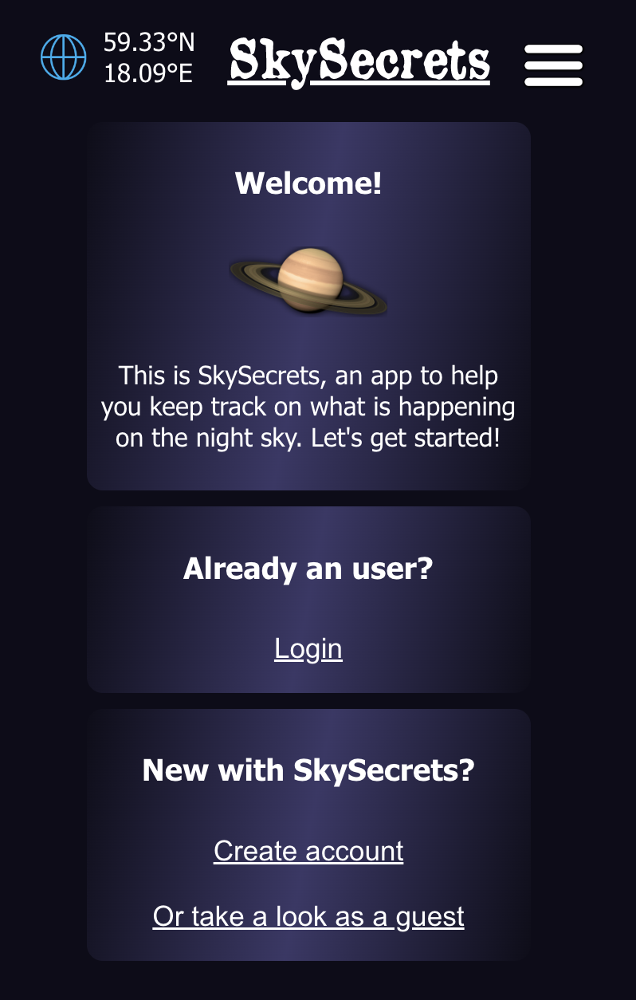
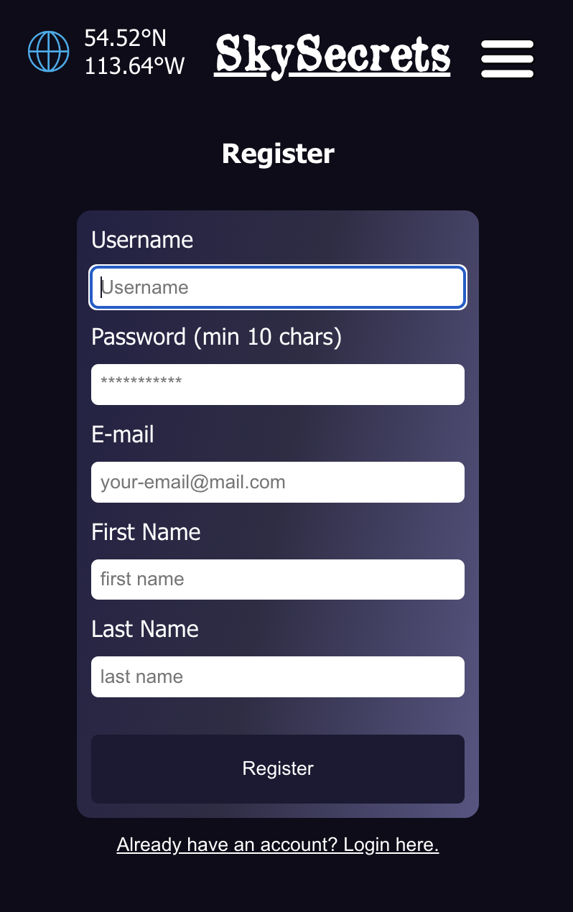
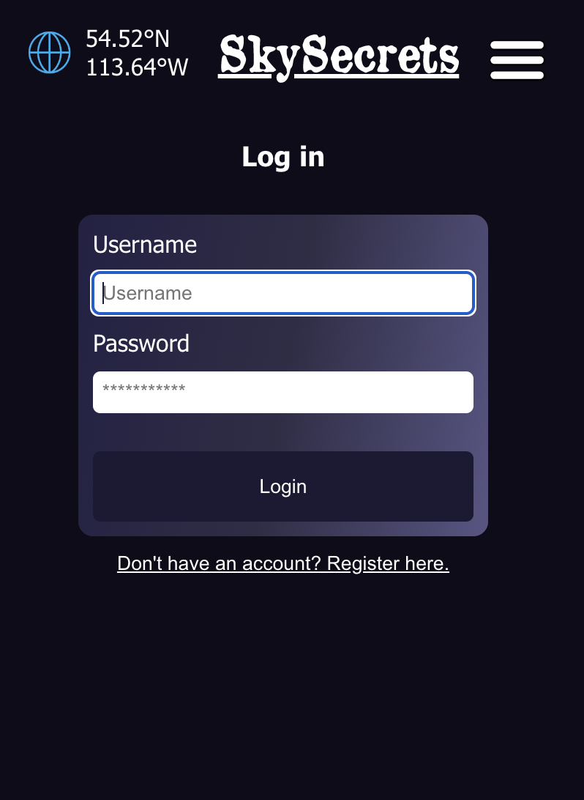

## Guest user
As a guest user, you can:
- Set a location, but this will not be saved if the page refreshes or the app is closed
- Based on the location, the following is available:
  - Overview: A quick overview with sun, moon, planets and aurora.
  - Aurora: chances of seeing aurora at the chosen location
  - Moon: The phase, illumation and rise/setting times of the moon
  - Image of the day: To see NASAs image of the day
  - Planets: See which planets that are currently over the horizon and their parameters
  - K-index: Information about Kp-index

### Navigate
Explore the app via the menu

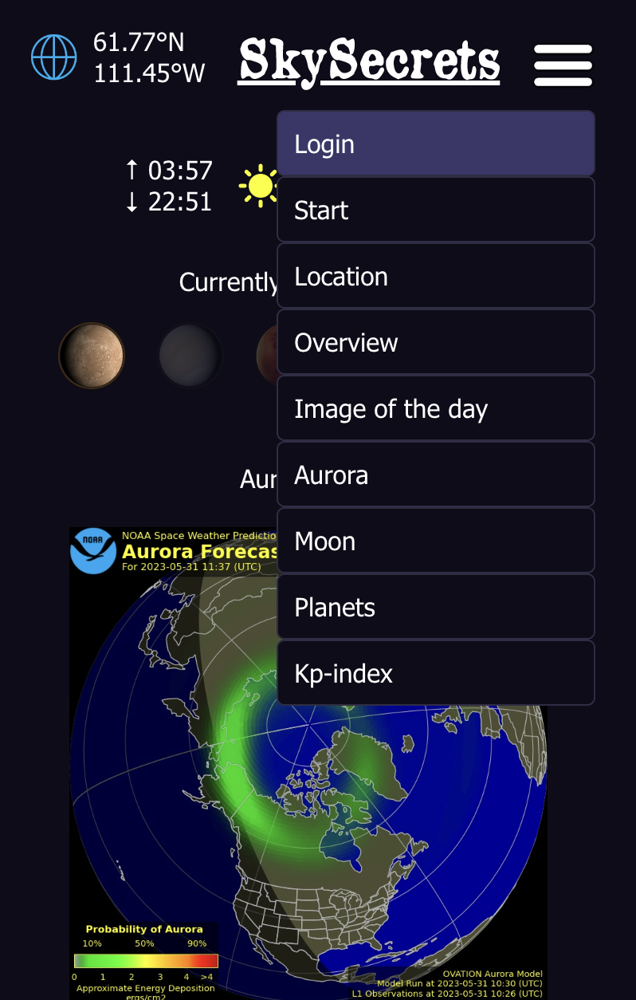

### Examples of: Overview, Aurora, Moon, Planets and Jupiter pages:

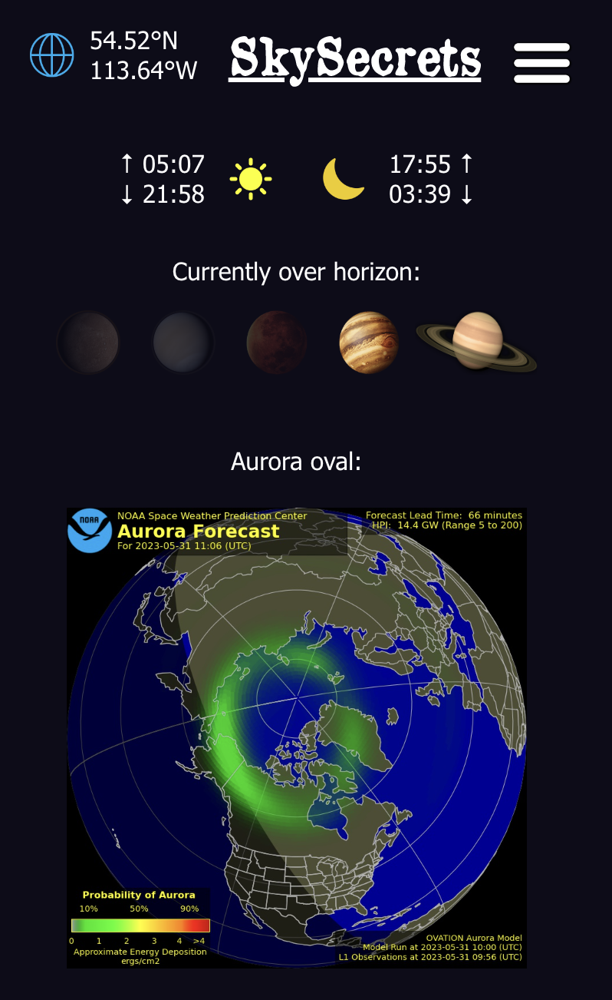
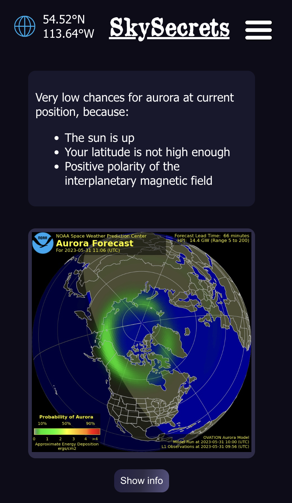
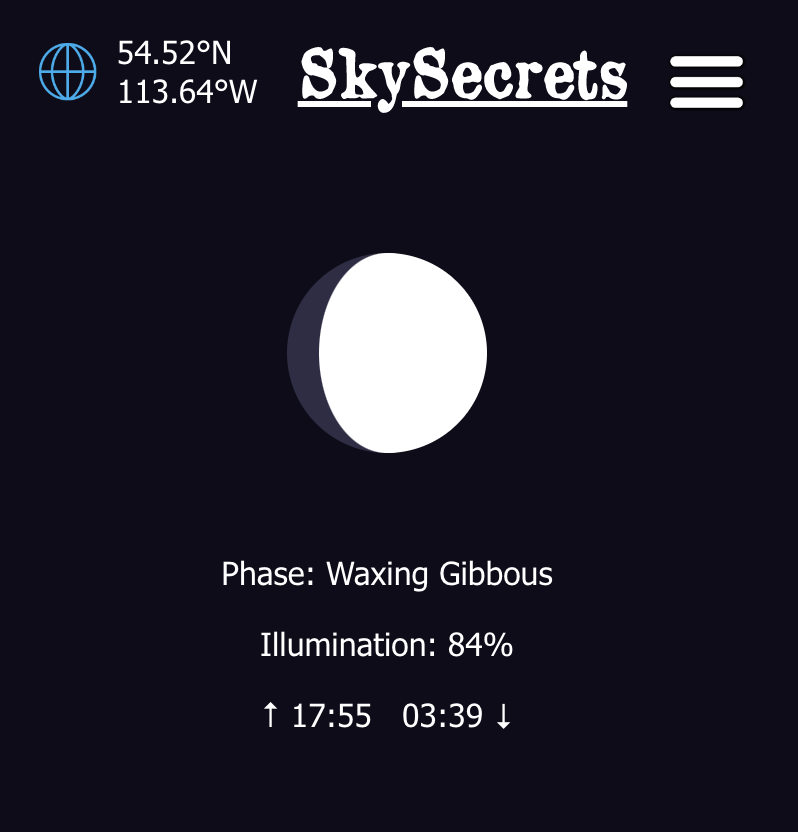
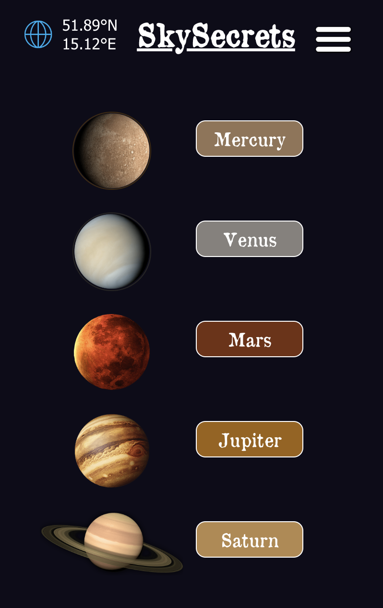
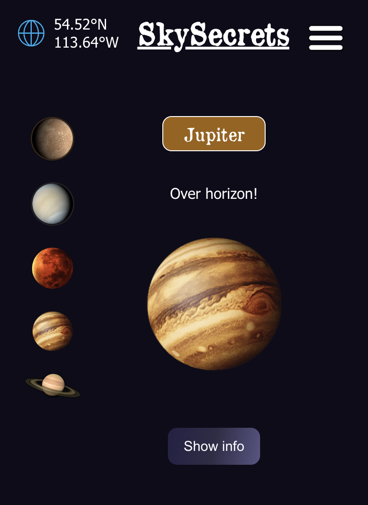

## Logged in user
### The welcome and dropdown-menu now looks a little diffrent:

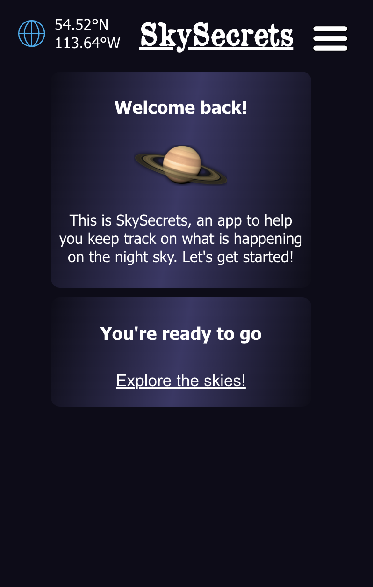
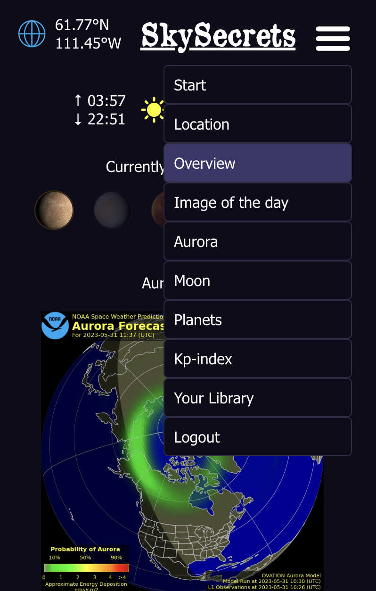

If you get an account and log in, you can:
- Set a location that is saved for future use
- If you like the image of the day from NASA (very likely that you do!) you can save it to your personal library of cool astro-images 

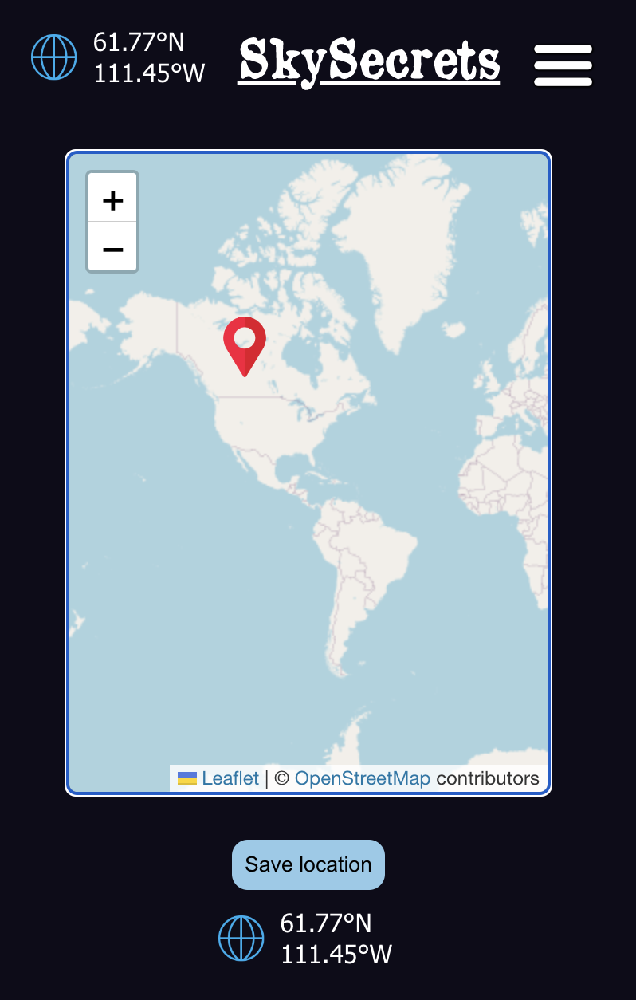
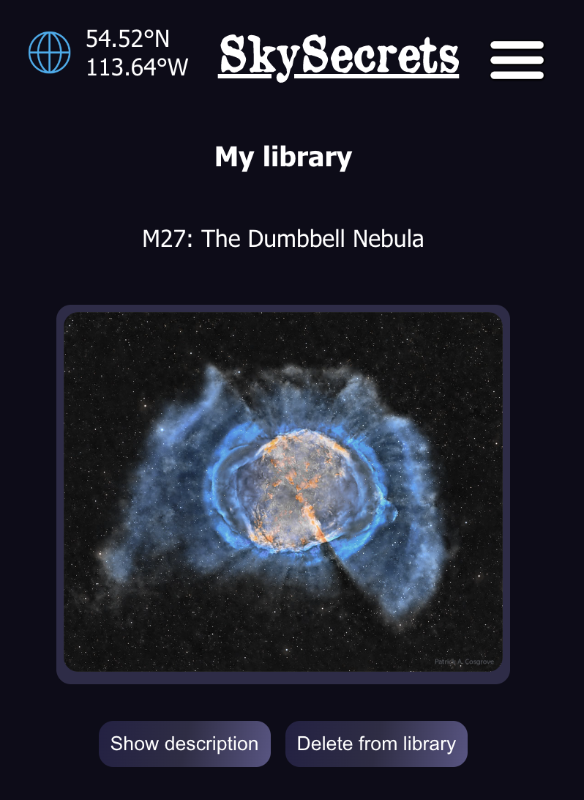
